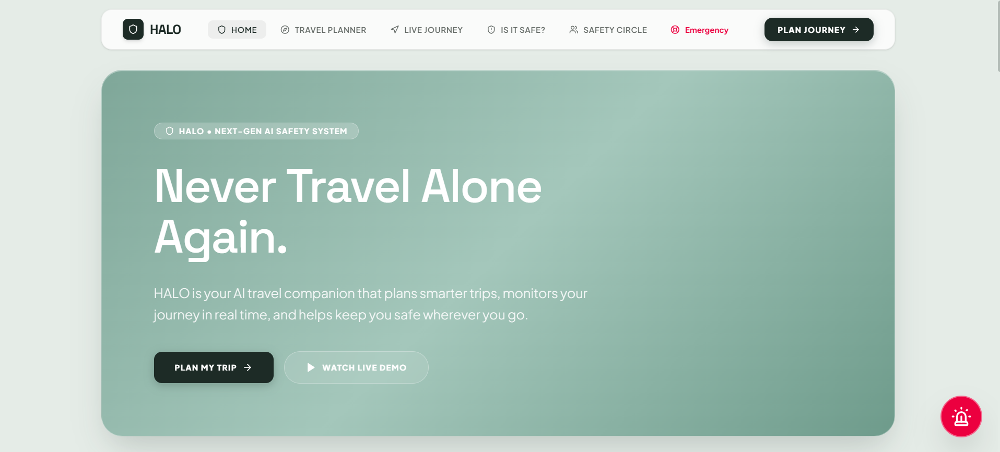
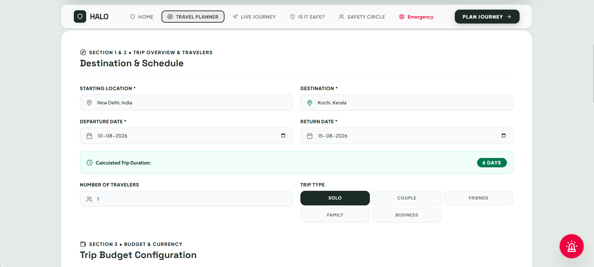
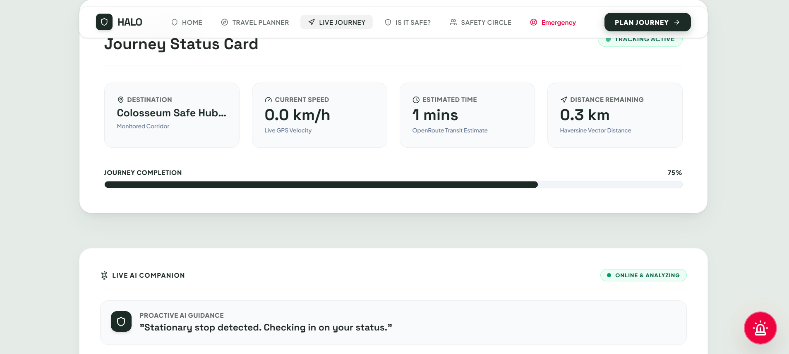
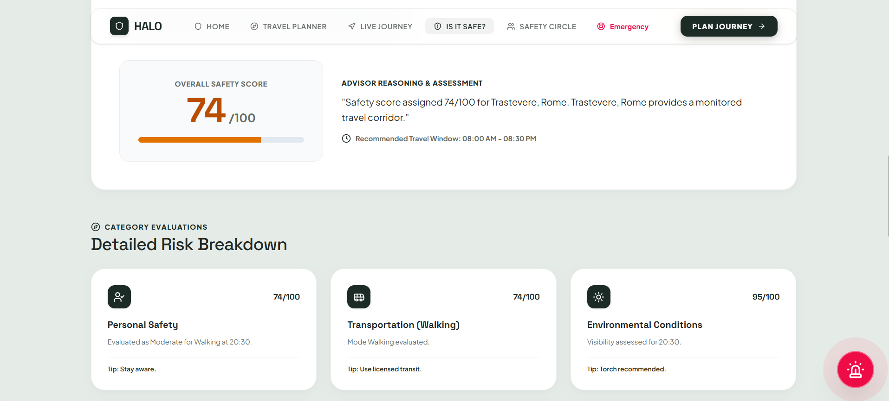
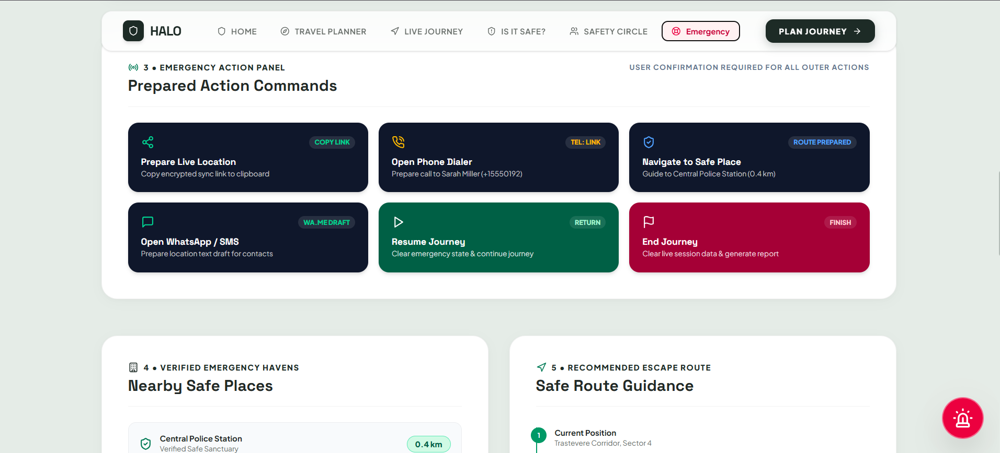

# 🛡️ HALO

### Plan Smarter. Travel Safer. Journey Together.

HALO is an AI-powered travel companion developed during an AI Hackathon to make travel planning safer, smarter, and more convenient. It combines trip planning, destination safety analysis, live journey monitoring, and emergency assistance into a single platform.

---

## 📸 Project Preview

### 🏠 Home


### ✈️ AI Trip Planner


### 🚶 Live Journey Monitoring


### Is It Safe


### 🚨 Emergency Command Center


---

## ✨ Features

- 🧳 AI-powered Trip Planner
- 🛡️ Destination Safety Analysis
- 🚶 Live Journey Monitoring
- 🚨 One-tap Emergency SOS
- 📍 Live Location Tracking (Demo)
- 🤖 AI-generated Travel Recommendations
- 💰 Budget Planning
- 🎒 Smart Packing Suggestions

---

## 🤖 AI Integration

HALO uses **Google Gemini AI** to:

- Generate personalized travel itineraries
- Analyze destination safety
- Recommend accommodations and activities
- Provide travel tips and emergency guidance

---

## 🛠️ Tech Stack

**Frontend**
- React
- Vite
- Tailwind CSS

**AI**
- Google Gemini API
- Prompt Engineering

**Tools**
- Git
- GitHub
- Visual Studio Code

---

## 🚀 Getting Started

Clone the repository:

```bash
git clone https://github.com/Far-zanah/hackathon-2026.git
```

Install dependencies:

```bash
npm install
```

Run the development server:

```bash
npm run dev
```

Open your browser and visit:

```
http://localhost:3000
```

---

## 🤝 Acknowledgements

HALO was developed collaboratively during an AI Hackathon. This repository represents our team's collective effort in brainstorming, designing, implementing, testing, and refining the project within a limited timeframe. AI-assisted development tools were used during implementation while the project was developed collaboratively by the team.

---

## 📌 Future Improvements

- Real-time GPS integration
- Push notifications
- Native Android/iOS application
- Voice-enabled AI assistant
- User authentication
- Journey history and analytics

---

## Team
- Fathima Farzana
- Fidha Fathima
- Sulaima Shah

---

## 📄 License

This project was created for educational and hackathon purposes.